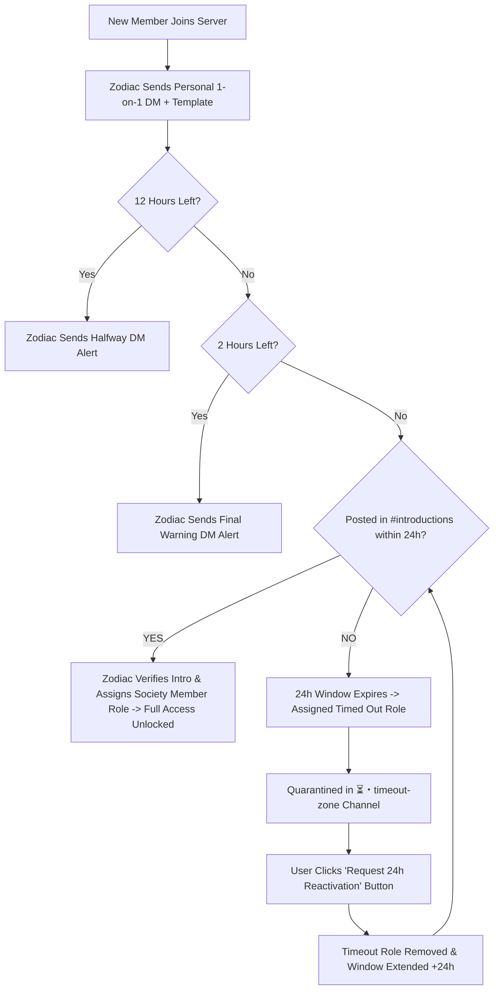

# 🏛️ ZODIAC: System Architecture, Onboarding Protocols & Operational Manual

> **Last Updated**: 2026-09-21  
> **Repository**: [https://github.com/tanbhirhaque/zodiac](https://github.com/tanbhirhaque/zodiac)  
> **Live Production Endpoint**: [https://zodiac-fc56.onrender.com/health](https://zodiac-fc56.onrender.com/health)  
> **Discord Server**: Dead Lead Society (`1549028696512405594`)  
> **Bot Client ID**: `1549546723771416666`

---

## 1. Executive Summary

**Zodiac** is the autonomous intelligence, onboarding gatekeeper, and pipeline reanimation engine for **Dead Lead Society** (*"Where Dead Leads Get a Second Chance"*).

Zodiac runs **24/7 on cloud infrastructure**, managing member lifecycle, automated industry intelligence dispatches, interactive closing sparring labs, and forensic lead revival tools.

---

## 2. 24/7 Cloud Hosting & Deployment Architecture

```
[GitHub: tanbhirhaque/zodiac (main)]
                │
         (Auto Webhook)
                ▼
      [Render Cloud Web Service]
      - Runtime: Node.js (v20+)
      - Command: npm start -> src/bot.js
      - Port: 3000 (HTTP Health Server)
                │
         (Every 5 Minutes)
                ▼
      [UptimeRobot Monitor]
      - URL: https://zodiac-fc56.onrender.com/health
      - Status: Always Keep-Alive (Zero Sleep Mode)
```

- **Health Check Server**: `src/services/healthServer.js` listens on port `3000`.
- **Render Service**: Web service deployed in Oregon (US West). Auto-deploys upon git push to `main`.
- **UptimeRobot**: Pings `/health` every 5 minutes to prevent Render free-tier instance sleeping.
- **Verification Command**:
  ```bash
  curl https://zodiac-fc56.onrender.com/health
  ```
  Expected JSON:
  ```json
  {
    "status": "online",
    "service": "Zodiac",
    "organization": "Dead Lead Society",
    "tagline": "Where Dead Leads Get a Second Chance.",
    "uptimeSeconds": 86400,
    "timestamp": "2026-09-21T03:58:29.321Z"
  }
  ```

---

## 3. Member Onboarding & Gatekeeper Protocol

### A. The Strict Gatekeeper Condition
* **New members who join receive ZERO roles.**
* Only members who submit a valid introduction in `💬・introductions` are granted the **`Society Member`** credential.
* Without `Society Member`, all 14 core institutional departments (150+ channels) are completely invisible and locked (`deny: ViewChannel` for `@everyone`).

### B. The 5-Step Lifecycle



1. **Step 1: Join (`GuildMemberAdd`)**:
   - Zodiac logs the member in `data/onboarding-tracker.json` with a 24-hour deadline.
   - Sends a direct message (DM) containing the official introduction template:
     ```yaml
     Name / Agency: [Your Name / Agency or Company]
     Core Offer: [What B2B service or offer do you sell?]
     Target ICP: [Industry, company size, or ideal buyer titles]
     Stalled Pipeline: [Where are prospects currently ghosting or dying?]
     ```
   - Posts a public orientation roadmap in `👋・welcome` or `💬・introductions`.

2. **Step 2: Halfway Reminder (12h Left)**:
   - Automated cron in `src/services/scheduler.js` detects `<= 12 hours` remaining.
   - Dispatches a DM reminder: *"⏰ HALFWAY NOTICE: 12 Hours Left to Complete Your Introduction"*.

3. **Step 3: Final Urgent Warning (2h Left)**:
   - Automated cron detects `<= 2 hours` remaining.
   - Dispatches an urgent DM warning: *"🚨 FINAL WARNING: 2 Hours Remaining to Activate Society Credentials"*.

4. **Step 4: Timeout Quarantine (Deadline Expired)**:
   - If 24 hours pass without an intro:
     - Member status changed to `"timed_out"`.
     - Member receives the **`Timed Out`** role (ID: `1551439003822329918`).
     - Permission to send messages in `💬・introductions` is revoked.
     - Member is quarantined to `⏳・timeout-zone` (ID: `1551439009031389184`).
     - Zodiac posts an alert with button: `[🔄 Request 24h Reactivation]`.
     - User also receives an expiration notice via DM.

5. **Step 5: Verification & Full Unlock (`MessageCreate`)**:
   - When a member posts an introduction in `💬・introductions`:
     - Zodiac verifies message length and format in `src/services/onboardingService.js`.
     - Strictly assigns **`Society Member`** role (ID: `1551325010692673677`).
     - Removes `Timed Out` or legacy roles if present.
     - Adds user ID to `data/introduced-members.json` and updates `data/onboarding-tracker.json`.
     - Sends branded celebratory unlock embed and reacts with 💀 and 🔥.
     - All 14 core institutional departments immediately unlock!

---

## 4. Role Hierarchy & Channel Permissions (Least Privilege)

### Roles Structure:
1. `Dead Lead Society` (Bot Role, Pos 8, Administrator)
2. `Admin` (Pos 7)
3. `Moderator` (Pos 6)
4. `Founder` (Pos 3, ID: `1551325003054719038`)
5. `Inner Circle` (Pos 2, ID: `1551325007479832578`)
6. `Society Member` (Pos 1, ID: `1551325010692673677`)
7. `Timed Out` (Quarantine Role, ID: `1551439003822329918`)
8. `@everyone` (Pos 0)

> **Critical Note on Legacy Bug**:
> An old legacy role named `Community Member` existed previously. The codebase was updated so `onboardingService.js` strictly targets `Society Member`. Never re-introduce `Community Member` in permissions.

### Channel Permission Segmentation:
- **`@everyone`**:
  - `START HERE` category: Allowed `ViewChannel`, `ReadMessageHistory`. Denied `SendMessages` on `#welcome`, `#rules`, `#server-map`. Allowed `SendMessages` on `#introductions`.
  - All other 14 core categories + 9 VIP categories: Strictly `deny: ViewChannel`.
- **`Timed Out`**:
  - `💬・introductions`: Denied `SendMessages`.
  - `⏳・timeout-zone`: Allowed `ViewChannel`, `ReadMessageHistory`. Denied `SendMessages` (interactive button only).
  - All other channels: Denied `ViewChannel`.
- **`Society Member`**:
  - Unlocks all 14 Core Institutional Departments (Discussion labs, graveyard, tools, templates).
  - Broadcast feeds (`#market-trends`, `#demand-signals`): Read-only with reactions allowed.
  - All 9 `Inner Circle` categories: Strictly `deny: ViewChannel`.
- **`Inner Circle`**:
  - Full access to Society Member channels + all private VIP War Rooms, Reanimation Labs, Account Teardowns.

---

## 5. Automated Background Schedules (`src/services/scheduler.js`)

Timezone: `Asia/Dhaka` (Configurable via `TIMEZONE` env variable).

| Schedule (Cron) | Feature | Target Channel(s) | Description |
| :--- | :--- | :--- | :--- |
| **`0 9 * * *`** (9:00 AM) | **Morning Market Recon** | `#market-trends`, `#market-research` | Scrapes B2B commercial news & funding signals; posts 3-part macro analysis. |
| **`0 12 * * *`** (12:00 PM) | **Daily Lead Autopsy Challenge** | `#lead-autopsy` | Posts a real-world ghosted account teardown with interactive reveal button `[🔍 Reveal Forensic Diagnosis]`. |
| **`0 19 * * *`** (7:00 PM) | **Evening Outreach Catalysts** | `#demand-signals`, `#niche-selection` | Posts daily outreach triggers, cold email hooks & industry catalysts. |
| **`*/15 * * * *`** (Every 15m) | **Onboarding Timeout Watchdog** | Background / DM / `#timeout-zone` | Evaluates member deadlines; sends 12h & 2h alerts; quarantines expired users. |

---

## 6. Complete 14 Slash & Prefix Commands

1. **`/reanimate`** (`!reanimate`): Revives stalled deals with 3 psychological recovery scripts (including the 9-word reset).
2. **`/roast`** (`!roast`): Audits cold email copy for spam triggers, C-suite tone, and generates high-status rewrites.
3. **`/duel`** (`!duel`): Objection sparring against an executive decision-maker with interactive button selections.
4. **`/trigger [industry]`** (`!trigger`): Returns active intent signals and buying triggers for SaaS, Agency, FinTech, Ecom, Logistics.
5. **`/calculator [leads] [dealSize]`** (`!calculator`, `!math`): Quantifies dormant pipeline cash and calculates needed outbox volume.
6. **`/dns [domain]`** (`!dns`): Checks SPF, DMARC, and MX DNS records for deliverability protection.
7. **`/clause [type]`** (`!clause`): Generates kill-fee, ghosting, and delinquency legal clauses for agency contracts.
8. **`/niche`**: Analyzes offer parameters and matches high-probability buyer committees.
9. **`/streak`**: Tracks consecutive daily outbound execution habits.
10. **`/win [dealSize] [niche]`**: Celebrates closed revenue wins in community channels.
11. **`/apply`**: Opens the VIP Inner Circle application modal form (`modal_vip_apply`).
12. **`/audit`**: Scans server permissions and verifies zero privacy leaks into Inner Circle categories.
13. **`/news`**: Manually triggers an on-demand market intelligence broadcast.
14. **`/setup [dry_run]`**: Idempotently syncs and builds all configured roles, categories, and channels from `config/server-structure.json`.

---

## 7. Tactical Mentorship (@Zodiac Mention)

- Trigger: Mentioning `@Zodiac` anywhere or starting a message with `!ask`.
- Handled by: `src/services/mentorService.js`.
- Capabilities: Answers B2B acquisition strategy, ICP selection, objection handling, deliverability questions, and sales framing.

---

## 8. Directory & File Reference

```
DeadLeadSocietyBot/
├── config/
│   └── server-structure.json          # 158-channel institutional blueprint & permissions
├── data/
│   ├── introduced-members.json        # Array of verified member user IDs
│   ├── onboarding-tracker.json        # Deadlines, notices sent, status per member
│   └── posted-news.json               # Deduplication cache for RSS news articles
├── src/
│   ├── bot.js                         # Main gateway entry point, intent detection & event router
│   ├── config.js                      # Environment validator & server structure loader
│   ├── commands/                      # 14 slash command handlers
│   │   ├── apply.js                   # VIP Modal application handler
│   │   ├── audit.js                   # Security audit command
│   │   ├── calculator.js              # Pipeline math command
│   │   ├── clause.js                  # Contract clauses generator
│   │   ├── dnsScan.js                 # DNS deliverability scanner
│   │   ├── duel.js                    # Sparring game with button interactions
│   │   ├── news.js                    # Manual news command
│   │   ├── nicheMatch.js              # ICP matcher
│   │   ├── reanimate.js               # Reanimation scripts
│   │   ├── roast.js                   # Copy auditor
│   │   ├── setup.js                   # Idempotent server builder
│   │   ├── streak.js                  # Habit tracker
│   │   ├── trigger.js                 # Intent signals
│   │   └── win.js                     # Win celebration
│   ├── services/
│   │   ├── autopsyService.js          # Lead autopsy challenge & button reveals
│   │   ├── channelManager.js          # Idempotent channel/category creation
│   │   ├── healthServer.js            # Port 3000 HTTP server for UptimeRobot
│   │   ├── mentorService.js           # @Zodiac tactical AI responder
│   │   ├── newsService.js             # Multi-feed RSS scraper & embed formatter
│   │   ├── onboardingService.js       # #introductions message verification
│   │   ├── permissionManager.js       # Overwrite builder & permissions checker
│   │   ├── roleManager.js             # Idempotent role creation & duplicate auditor
│   │   ├── scheduler.js               # Cron coordinator (News, Autopsy, Timeout Watchdog)
│   │   ├── serverSetup.js             # Full server orchestrator
│   │   ├── timeoutEnforcementService.js# 24h deadline tracker, DM alerts & quarantine zone
│   │   └── welcomeGuideService.js     # Orientation cards & new member join router
│   └── utils/
│       ├── helpers.js                 # Embed builder, brand palette, channelMatches
│       └── logger.js                  # Color-coded contextual terminal logger
├── render.yaml                        # Render cloud blueprint config
├── HOSTING_GUIDE.md                   # 24/7 deployment guide
├── OPERATIONS_AND_ARCHITECTURE.md     # This comprehensive operational manual
└── package.json                       # Dependencies (discord.js v14, node-cron, rss-parser)
```

---

## 9. Maintenance & Emergency Operations

### Checking Cloud Status:
Visit `https://zodiac-fc56.onrender.com/health` in any browser.

### Updating Code in Production:
1. Make code changes in local repository.
2. Commit and push to `main`:
   ```bash
   git add .
   git commit -m "update description"
   git push origin main
   ```
3. Render will auto-build and deploy in ~60 seconds.

### Manually Resetting an Expired Member:
If an admin wants to manually reset a timed-out user, remove the `Timed Out` role in Discord, or in `data/onboarding-tracker.json` set `status: "pending"` and give them a new `deadline`.
Alternatively, instruct the user to click the **`[🔄 Request 24h Reactivation]`** button in `⏳・timeout-zone`.
